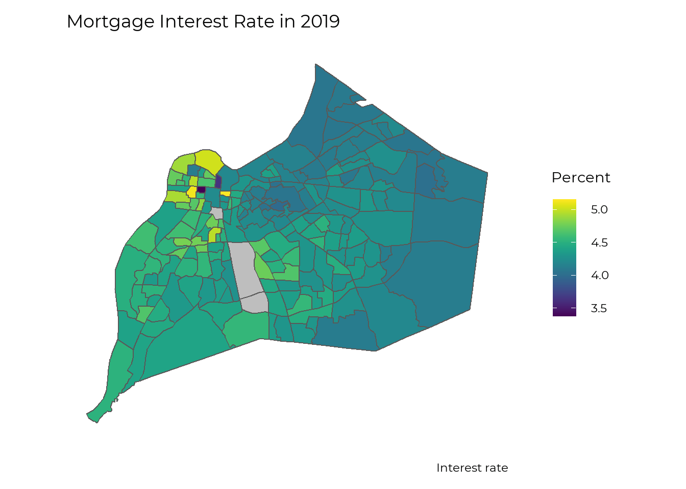

## Overall

There is no direct data on Black Wealth in Louisville. We will look at both national data and some local homeownership data to give the most complete information currently available. 

Wealth data remains scarce in general because wealth is not talked about and is not taxed. Multiple surveys ask about income, and tax records show yearly income. Our measures of wealth remain indirect. 

A national survey that takes place every three years is our best source of wealth data. The most recent available data is from 2019, and so the impact of the ongoing pandemic is unknown. The key findings from the [Federal Reserve report](https://www.federalreserve.gov/econres/notes/feds-notes/disparities-in-wealth-by-race-and-ethnicity-in-the-2019-survey-of-consumer-finances-20200928.htm):

- The median white family has \$188,200, while the median Black family has \$24,100, less than 15% of what White families have
- After falling from 2007 to 2013, median Black wealth has increased from 2013-2019, however the gap between White and Black families remains largely unchanged. 
- The gap in wealth starts at an early age, with White families under 35 having a median wealth of \$25,400 and Black families having \$600. 
- Inheritances and other sources of family support are the single largest driver of the racial wealth gap. 
- White families are more likely to own homes at any age, but the Black-White gap is largest in households under 35, likely reflecting parental wealth. 

## Housing 

While Housing is not all of wealth, it does represent a major component of wealth. Housing reflects both historical wealth patterns (parental wealth makes it easier to buy a home) and is a major generator of wealth as historically homes have risen in value, increasing the wealth of those who own them. 

The data shows stark divides by raise throughout the entire homeownership process. We’ll use the data to trace how the entire process reinforces the wealth gap.

### Initial Wealth

We start with the overall wealth data showing less parental wealth and therefore less help with purchasing an initial home. While the wealth gap has a number of causes, a major cause related to housing is [redlining](https://www.arcgis.com/apps/MapSeries/index.html?appid=a73ce5ba85ce4c3f80d365ab1ff89010) - explicitly denying loans to Black families who wanted to purchase houses in certain neighborhoods. 

With housing data we can turn from looking nationally to look specifically at Louisville. 

### Application Process

The application process for loans is the next step, and Black residents are denied at nearly twice the rate of white residents

If accepted, interest rates are higher and the overall mortgage amount is lower.

Overall, In Louisville, Black residents receive fewer than half the number of mortgages per capita as White residents. 

![]mortgage_number_race.png)

[Nationally](https://www.federalreserve.gov/econres/notes/feds-notes/disparities-in-wealth-by-race-and-ethnicity-in-the-2019-survey-of-consumer-finances-20200928.htm), we see that in households under 35, 46% of White families own houses, compared to only 17% of Black families. While this gap closes a little as households age, early ownership allows for more time to build wealth. 

### Home Values over Time

The story of the Black-White wealth gap doesn’t stop after a Black family acquires a house. While we only have home appreciation values by geography, there is a clear pattern where houses in black neighborhoods appreciate at a slower rate, and therefore build less wealth. 

### Devaluation of Houses in Black Neighborhoods

Looking at national numbers, owner-occupied homes in Black neighborhoods are [undervalued by $48,000 per house](https://www.brookings.edu/research/devaluation-of-assets-in-black-neighborhoods/). In the Louisville Metro Area, the median home value in majority Black neighborhoods is \$89,681, but would be \$117,593 if houses were not devalued. [This is a 27% decrease](https://www.brookings.edu/research/devaluation-of-assets-in-black-neighborhoods/) from what home values would be based on structural characteristics (e.g. sq. ft, year built) and neighborhood amenities (e.g. walkability, school districts, commute time).

### Property Taxes

While facing lower home values on the market, Black households actually have their homes overvalued by the property tax administration, and thus face [higher taxation relative to the market value of their homes](https://www.washingtonpost.com/context/the-assessment-gap-racial-inequalities-in-property-taxation/215957a4-d5ad-47cd-821a-070cf23b6bc7/). 

## A Repeating Pattern

We have the most data on housing - but this is not the only area of wealth building where this same pattern plays out. Black families both start with less wealth (and therefore less opportunities to build on it even in a ‘fair’ market) and face discrimination at each step of the process. 