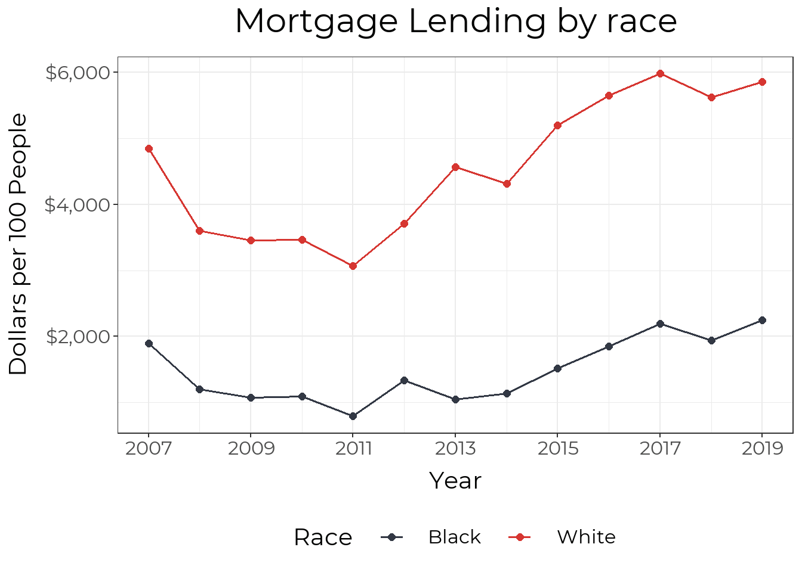

```{r set up, message = FALSE, warning = FALSE}
library(tidyverse)
library(magrittr)
library(showtext)
library(rgdal)
library(sf)
library(viridis)

load("glptools_exports.RData")

library(showtext)
showtext_auto()

font_add("Montserrat", "Montserrat/Montserrat-Regular.ttf")
font_add("Montserrat Bold", "Montserrat/Montserrat-SemiBold.ttf")

make_map <- function(indicator, title = "", legend = "", caption = "", no_legend = FALSE, vir_dir = 1){
  plt <- ggplot(jfco_sf) + 
  geom_sf(aes(fill={{ indicator }} )) +
  # scale_fill_gradient(low = "#323844", high = "#d63631", name = "Percent") +
  scale_fill_viridis(na.value = "grey", name = legend, direction = vir_dir) +
  theme_bw(base_size = 22) +
  theme(plot.caption = element_text(lineheight = .5)) +
  theme(text = element_text(family = "Montserrat"),
        panel.grid = element_blank(),
        axis.text = element_blank(),
        axis.ticks = element_blank(),
        axis.title = element_blank(),
        panel.border = element_blank()) +
  labs(title = title,
       caption = caption)
  
  if (no_legend == TRUE){
    plt <- plt + theme(legend.position = "none")
  }
  
  plt <- plt +
    theme(
      panel.background = element_rect(fill = "transparent", color = NA), # bg of the panel
      plot.background = element_rect(fill = "transparent", color = NA), # bg of the plot
      legend.background = element_rect(fill = "transparent", color = "transparent"), # get rid of legend bg
      legend.box.background = element_rect(fill = "transparent", color = "transparent"), # get rid of legend panel bg
      legend.key = element_rect(fill = "transparent",colour = NA))
  
  return(plt)
}
```

```{r shapefile}
jfco_shp <- readOGR("JC Tracts", layer = "JC Tracts",
                     GDAL1_integer64_policy = TRUE, verbose = FALSE)

jfco_sf <- st_as_sf(jfco_shp) %>%
  mutate(GEOID = str_sub(GEO_ID, start = -11))
```


## Overall

There is no direct data on Black Wealth in Louisville. We will look at both national data and some local homeownership data to give the most complete information currently available. 

Wealth data remains scarce in general because wealth is not talked about and is not taxed. Multiple surveys ask about income, and tax records show yearly income. Our measures of wealth remain indirect. 

A national survey that takes place every three years is our best source of wealth data. The most recent available data is from 2019, and so the impact of the ongoing pandemic is unknown. The key findings from the [Federal Reserve report](https://www.federalreserve.gov/econres/notes/feds-notes/disparities-in-wealth-by-race-and-ethnicity-in-the-2019-survey-of-consumer-finances-20200928.htm):

- The median white family has \$188,200, while the median Black family has \$24,100, less than 15% of what White families have
- After falling from 2007 to 2013, median Black wealth has increased from 2013-2019, however the gap between White and Black families remains largely unchanged. 
- The gap in wealth starts at an early age, with White families under 35 having a median wealth of \$25,400 and Black families having \$600. 
- Inheritances and other sources of family support are the single largest driver of the racial wealth gap. 
- White families are more likely to own homes at any age, but the Black-White gap is largest in households under 35, likely reflecting parental wealth. 

## Housing 

While Housing is not all of wealth, it does represent a major component of wealth. Housing reflects both historical wealth patterns (parental wealth makes it easier to buy a home) and is a major generator of wealth as historically homes have risen in value, increasing the wealth of those who own them. 

The data shows stark divides by raise throughout the entire homeownership process. We’ll use the data to trace how the entire process reinforces the wealth gap.

### Initial Wealth

We start with the overall wealth data showing less parental wealth and therefore less help with purchasing an initial home. While the wealth gap has a number of causes, a major cause related to housing is [redlining](https://www.arcgis.com/apps/MapSeries/index.html?appid=a73ce5ba85ce4c3f80d365ab1ff89010) - explicitly denying loans to Black families who wanted to purchase houses in certain neighborhoods. 

With housing data we can turn from looking nationally to look specifically at Louisville. 

### Application Process

The application process for loans is the next step, and Black residents are denied at nearly twice the rate of white residents


If accepted, interest rates are higher and the overall mortgage amount is lower.




Overall, In Louisville, Black residents receive fewer than half the number of mortgages per capita as White residents. 


[Nationally](https://www.federalreserve.gov/econres/notes/feds-notes/disparities-in-wealth-by-race-and-ethnicity-in-the-2019-survey-of-consumer-finances-20200928.htm), we see that in households under 35, 46% of White families own houses, compared to only 17% of Black families. While this gap closes a little as households age, early ownership allows for more time to build wealth. 

### Home Values over Time

The story of the Black-White wealth gap doesn’t stop after a Black family acquires a house. While we only have home appreciation values by geography, there is a clear pattern where houses in Black neighborhoods appreciate at a slower rate, and therefore build less wealth. 


### Devaluation of Houses in Black Neighborhoods

Looking at national numbers, owner-occupied homes in Black neighborhoods are [undervalued by $48,000 per house](https://www.brookings.edu/research/devaluation-of-assets-in-black-neighborhoods/). In the Louisville Metro Area, the median home value in majority Black neighborhoods is \$89,681, but would be \$117,593 if houses were not devalued. [This is a 27% decrease](https://www.brookings.edu/research/devaluation-of-assets-in-black-neighborhoods/) from what home values would be based on structural characteristics (e.g. sq. ft, year built) and neighborhood amenities (e.g. walkability, school districts, commute time).

### Property Taxes

While facing lower home values on the market, Black households actually have their homes overvalued by the property tax administration, and thus face [higher taxation relative to the market value of their homes](https://www.washingtonpost.com/context/the-assessment-gap-racial-inequalities-in-property-taxation/215957a4-d5ad-47cd-821a-070cf23b6bc7/). 

## A Repeating Pattern

We have the most data on housing - but this is not the only area of wealth building where this same pattern plays out. Black families both start with less wealth (and therefore less opportunities to build on it even in a ‘fair’ market) and face discrimination at each step of the process. 

# Home Mortgages {.tabset .tabset-fade .tabset-pills}

## Mortgages by geography

In 2019, about 3.8 mortgages were issued per 100 residents; however, the availability of mortgages varies greatly across the city. Two census tracts saw 0 mortgages issued in 2019, and most of West Louisville saw fewer than 1 mortgage issued per 100 residents. Meanwhile, many areas experienced a much larger availability of mortgages, especially where there is new construction around the edges of the county.

```{r mortgages_per_person}
home_loan_tract_race <- home_loan_tract %>%
  filter(year == 2019, sex == "total", race != "total") %>%
  select(tract, race, denial:rate_spread)

home_loan_tract %<>%
  filter(year == 2019, sex == "total", race == "total") %>%
  select(tract, denial:rate_spread)

jfco_sf %<>% left_join(home_loan_tract, by = c("GEOID" = "tract"))

loan_num_labs <- c("No mortgages", "Less than 1", "1 to 3", "3 to 5", "5 to 10", "More than 10")

jfco_sf %<>%
  mutate(
    loan_num_fill = 
      case_when(
        loan_number_per_100 == 0 ~ loan_num_labs[1],
        loan_number_per_100 <= 1 ~ loan_num_labs[2],
        loan_number_per_100 <= 3 ~ loan_num_labs[3],
        loan_number_per_100 <= 5 ~ loan_num_labs[4],
        loan_number_per_100 <= 10 ~ loan_num_labs[5],
        loan_number_per_100 > 10 ~ loan_num_labs[6],
        is.na(loan_number_per_100) ~ NA_character_,
        TRUE ~ "error!!") %>%
      factor(levels = loan_num_labs, ordered = TRUE))

ggplot(jfco_sf) + 
  geom_sf(aes(fill = loan_num_fill)) +
  scale_fill_manual(values = viridis::viridis(6, direction = -1), na.value = "grey") +
  theme_bw(base_size = 22, base_family = "Montserrat") +
  theme(panel.grid = element_blank(),
        axis.text = element_blank(),
        axis.ticks = element_blank(),
        axis.title = element_blank(),
        panel.border = element_blank(),
        legend.title = element_blank()) +
  labs(title = "Mortgages issued per 100 residents in 2019") +
  theme(
    panel.background = element_rect(fill = "transparent", color = NA), # bg of the panel
    plot.background = element_rect(fill = "transparent", color = NA), # bg of the plot
    legend.background = element_rect(fill = "transparent", color = "transparent"), # get rid of legend bg
    legend.box.background = element_rect(fill = "transparent", color = "transparent"), # get rid of legend panel bg
    legend.key = element_rect(fill = "transparent",colour = NA))
```

## Mortgages by race

We can also examine mortgage data by race. Black residents in Louisville received fewer than half the number of mortgages per person that White residents did in 2019.

```{r mortgage_number_race}

# Interactive Mortgage map
# load("home_loans_detail.RData")
# home_loan_detail %<>%
#   select(tract, year, race, sex, loan_status, income, loan, rate) %>%
#   mutate(tract = str_extract(tract, "21111.*")) %>%
#   filter(year == 2019, loan_status == "approved")
# 
# num_points <- home_loan_detail %>%
#   group_by(tract) %>%
#   summarise(n = n(), .groups="drop") %>%
#   left_join(glptools::map_tract, by = "tract") %>%
#   group_by(tract) %>%
#   nest() %>%
#   mutate(points = map(data, function(x) st_sample(x$geometry, x$n))) %>%
#   unnest()
# 
# home_loan_detail %<>% arrange(tract)
# num_points %<>% arrange(tract)
# 
# st_geometry(home_loan_detail) <- num_points$points
# 
# library(leaflet)
# 
# 
# fillpal <- colorFactor(RColorBrewer::brewer.pal(5, "Dark2"), domain = unique(home_loan_detail$race))
# 
# leaflet(filter(home_loan_detail, is.na(race))) %>%
#   addCircleMarkers(
#     radius = ~sqrt(loan / 30000),
#     #radius = 5,
#     stroke=T,
#     fillColor = ~fillpal(race),
#     color = ~fillpal(race),
#     weight = 1,
#     fillOpacity = 0.15,
#     opacity = 0.4) %>%
#   addLegend(pal = fillpal, values = unique(home_loan_detail$race)) %>%
#   addTiles()


mortgage_county <- home_loan_county

plt_by <- function(df, group_var, var, title_text = "Home Mortgages", 
                   y_axis = "Percent", y_min = NA, units = "number") {
  var <- enquo(var)
  group_var <- enquo(group_var)

  text_scale <- 1
  
  plt <- ggplot(data = df, aes(x = year, y = !!var, group = !!group_var, colour = !!group_var)) +
    geom_point(size = 2) +
    geom_line(size = .65) +
    theme_bw() +
    labs(title = title_text, x = "Year", y = y_axis) +
    theme(legend.position = "bottom")
  
  plt <- plt  + 
    scale_colour_manual(values = c("#323844", "#d63631")) +
    scale_x_continuous(breaks = seq(from = 2007, to = 2019, by = 2)) +
    theme(text = element_text(family = "Montserrat"),
          
          legend.title     = element_text(size = 30 * text_scale),
          legend.text      = element_text(size = 24 * text_scale,
                                          margin = margin(b = 0.2 * text_scale, t = 0.2 * text_scale, unit = "cm")),

          axis.text    = element_text(size = 24 * text_scale),
          axis.title   = element_text(size = 30 * text_scale),
          axis.title.x = element_text(margin = margin(t = 0.3 * text_scale, unit = "cm")),
          axis.title.y = element_text(margin = margin(r = 0.3 * text_scale, unit = "cm")),
      
          plot.title = element_text(size = 42 * text_scale,
                                    hjust = .5,
                                    margin = margin(b = 0.4 * text_scale, unit = "cm")))
  
  if (!is.na(y_min)) {
    plt <- plt + ylim(y_min, NA)
  }
  
  if(units == "Dollars") plt <- plt + scale_y_continuous(labels = scales::dollar)
  if(units == "Percent") plt <- plt + scale_y_continuous(labels = function(x) scales::percent(x, accuracy = 1, scale = 1))

  plt <- plt +
    theme(
      panel.background = element_rect(fill = "transparent", color = NA), # bg of the panel
      plot.background = element_rect(fill = "transparent", color = NA), # bg of the plot
      legend.background = element_rect(fill = "transparent", color = "transparent"), # get rid of legend bg
      legend.box.background = element_rect(fill = "transparent", color = "transparent"), # get rid of legend panel bg
      legend.key = element_rect(fill = "transparent",colour = NA)
  )
  
  plt
}

mortgage_county %<>% filter(FIPS == "21111", sex=="total", race %in% c("black", "white")) %>%
  rename(Race = race) %>%
  mutate(Race = str_to_title(Race))

plt_by(mortgage_county, Race, loan_number_per_100, "Mortgages by race", y_axis = "Mortgages per 100 People", y_min = 0)
```

## Mortgage Dollars by race

The racial disparity is mortgages is even larger when you incorporate the dollar amount of mortgages issues. In 2019, white residents received \$2.60 in mortgages for every \$1 that Black residents received after adjusting for population size.

```{r mortgage_dollars_race}
plt_by(mortgage_county, Race, loan_amount_pp, "Mortgage Lending by race", y_axis = "Dollars per 100 People", y_min = 0,
       units = "Dollars")
```


## Denial Rates by Race

Black residents are denied mortgages at a rate roughly twice that of white residents. The mortgage denial rate for Black residents has decreased from a high of 29% in 2008 to a low of 14% in 2019. However, it has not shown signs of decreasing in recent years, and Black residents are more likely to be impacted by the economic impacts of COVID-19, worsening the disparity in 2020 and beyond.

```{r mortgage_denial_race}
plt_by(mortgage_county, Race, denial, "Mortgage Denial by race", y_axis = "Denial Rate", y_min = 0, units= "Percent")
```

## Denial Rates by Geography

A major factor in mortgage availability is denial rates. While some areas of town saw few to no mortgage denials, people in many parts of West Louisville experienced denial rates of 30 to 40%.

```{r mortgage_denial}
make_map(denial, title = "Mortgage Denial Rate in 2019", 
         legend = "Percent", 
         caption = "Denial rate")
```

## Interest Rates by geography

For the mortgages that were issued, interest rates varied from around 3.5% to around 5%. While the average interest rate was around 4% for the much of East Louisville, average interest rates in West Louisville were closer to 5%. A 30-year mortgage with an interest rate of 5% requires monthly payments that are 13% higher than a mortgage with an interest rate of 4%.

```{r mortgage_interest}
make_map(rate, title = "Mortgage Interest Rate in 2019", 
         legend = "Percent", 
         caption = "Interest rate")
```

# Housing Price Changes {.tabset .tabset-fade .tabset-pills}

As Louisville grows, increasing home prices reflect changes in inflation and increasing demand for homes. Long-term growth in home prices helps homeowners build equity and wealth. Short-term appreciation can be a boon to homeowners with the finances to stay in their home, though it also causes many homeowners and renters to be dislocated from their neighborhood.

## Long-term appreciation

This map shows the change in existing home prices across zip codes since 2000, controlling for new construction. Since 2000, existing homes in Louisville have increased in value by an average of 57% (an average of about 2.4% per year). However, not every area of the city has benefited equally from this growth. Home prices in zip code 40204, which contains the Upper Highlands and Germantown, have more than doubled since 2000. While many zip codes close to downtown also saw high growth, many parts of West Louisville saw slow growth, and homes in 40212 lost value.

```{r long_term_appreciation}
lou_num <- HPI_county %>% filter(FIPS == "21111")

housing_price_index <- HPI_zip

housing_price_index %<>% 
  filter(year == 2019)

map_zip %<>% left_join(housing_price_index, by = "zip")

hpi_change <- c("Lost value", "0% - 25%", "25% - 50%", "50% - 75%", "75% - 100%", "100% - 125%")
hpi_2015_change <- c("Lost value", "0% - 10%", "10% - 20%", "20% - 30%", "30% - 40%", "40% - 50%")

map_zip %<>%
  mutate(
    hpi_fill = 
      case_when(
        HPI < 100 ~ hpi_change[1],
        HPI < 125 ~ hpi_change[2],
        HPI < 150 ~ hpi_change[3],
        HPI < 175 ~ hpi_change[4],
        HPI < 200 ~ hpi_change[5],
        HPI < 225 ~ hpi_change[6],
        is.na(HPI) ~ NA_character_,
        TRUE ~ "error!!") %>%
      factor(levels = hpi_change, ordered = TRUE),
    hpi_2015_fill = 
      case_when(
        HPI_2015 < 0 ~ hpi_2015_change[1],
        HPI_2015 < 10 ~ hpi_2015_change[2],
        HPI_2015 < 20 ~ hpi_2015_change[3],
        HPI_2015 < 30 ~ hpi_2015_change[4],
        HPI_2015 < 40 ~ hpi_2015_change[5],
        HPI_2015 < 50 ~ hpi_2015_change[6],
        is.na(HPI) ~ NA_character_,
        TRUE ~ "error!!") %>%
      factor(levels = hpi_2015_change, ordered = TRUE))

ggplot(map_zip) + 
  geom_sf(aes(fill = hpi_fill)) +
  scale_fill_manual(values = viridis::viridis(6, direction = -1), na.value = "grey") +
  #scale_fill_viridis() +
  theme_bw(base_size = 22, base_family = "Montserrat") +
  theme(panel.grid = element_blank(),
        axis.text = element_blank(),
        axis.ticks = element_blank(),
        axis.title = element_blank(),
        panel.border = element_blank(),
        legend.title = element_blank()) +
  labs(title = "Change in housing prices since 2000") +
  theme(
    panel.background = element_rect(fill = "transparent", color = NA), # bg of the panel
    plot.background = element_rect(fill = "transparent", color = NA), # bg of the plot
    legend.background = element_rect(fill = "transparent", color = "transparent"), # get rid of legend bg
    legend.box.background = element_rect(fill = "transparent", color = "transparent"), # get rid of legend panel bg
    legend.key = element_rect(fill = "transparent",colour = NA))
```

## Short-term appreciation

Looking at the growth since 2015 highlights zip codes where changes in home prices have been very acute. The average home in Louisville increased in value by 21% between 2015 and 2019. The vast majority of zip codes saw total growth of 10% - 30%, while changes in home prices for zip codes in West Louisville range from a decrease of 30% in 40212 to an increase of 40% in 40203. The rapid price increase in 40203, which contains parts of Russell and Old Louisville, threaten to displace many residents. In 40203, home prices across Louisville increased by an average of 8.8% per year.

```{r short_term_appreciation}
ggplot(map_zip) + 
  geom_sf(aes(fill = hpi_2015_fill)) +
  scale_fill_manual(values = viridis::viridis(6, direction = -1), na.value = "grey") +
  #scale_fill_viridis() +
  theme_bw(base_size = 22, base_family = "Montserrat") +
  theme(panel.grid = element_blank(),
        axis.text = element_blank(),
        axis.ticks = element_blank(),
        axis.title = element_blank(),
        panel.border = element_blank(),
        legend.title = element_blank()) +
  labs(title = "Change in housing prices since 2015") +
  theme(
    panel.background = element_rect(fill = "transparent", color = NA), # bg of the panel
    plot.background = element_rect(fill = "transparent", color = NA), # bg of the plot
    legend.background = element_rect(fill = "transparent", color = "transparent"), # get rid of legend bg
    legend.box.background = element_rect(fill = "transparent", color = "transparent"), # get rid of legend panel bg
    legend.key = element_rect(fill = "transparent",colour = NA))

```

# Housing Availability

Housing must be both affordable and available for families to have housing that meets their needs. Based on framework from the Housing Needs Assessment, we compare households' incomes to the price of housing available to them.

We use the Area Median Income (AMI) to group households and housing units. In 2019, the AMI for Louisville was \$76,400 for a family of four. (The AMI adjusts for household size.) We also use AMI to group homes and apartments by determining whether the housing would be affordable to households in that income group. Housing is affordable is a household spends less than 30% of their income on housing costs. For a fuller explanation of AMI, see the next section.

We find that households making less than 30% of AMI do not have enough housing units available to them. While 39,000 households have incomes below 30% of AMI, there are only enough affordable and available units for about half of them of them.

This creates an affordability gap for households making between 30% and 50% of AMI. While there are actually more housing units than households at this income level, many of them are occupied by households with lower incomes, making them unavailable. The same problem exists for households in the 80% AMI income group.

At higher income levels, we find that households generally have access to affordable housing.

Creating housing opportunities for households below 30% of AMI would help ease the housing gap not only for them, but for households in higher income groups as well.


```{r housing_availability, message=FALSE, warning=FALSE, eval=FALSE}
library(magrittr)

acs_micro_houses_ddi <- ipumsr::read_ipums_ddi("usa_00083.xml")
acs_houses_unoccupied <- ipumsr::read_ipums_micro(acs_micro_houses_ddi, verbose=F)

acs_houses_unoccupied %<>% clean_acs_micro()

acs_houses_unoccupied %<>% 
  filter(FIPS == "21111",
         year %in% 2015:2019)

acs_micro <- arrow::read_feather("../../glpdata/data-raw/microdata/acs_micro.feather")

# Create table of AMI limits based on HUD information
mult = c(0.7, 0.8, 0.9, 1 + seq(0, 0.64, by = 0.08))

mult_br = c(0.7, 0.75, 0.9, 1.04 + seq(0, 0.88, by = 0.12))

ami_table_16 <- data.frame(
  hh_size = rep(1:12),
  ami30    = c(15050, 17200, 20780, 25100, 29420, 33740, 38060, 42380, 
               plyr::round_any(42380 + (42380 / 1.32 * 0.08) * 1:4, 50, ceiling)),
  ami50    = c(25050, 28600, 32200, 35750, 38650, 41500, 44350, 47200, 
               plyr::round_any(47200 + (47200 / 1.32 * 0.08) * 1:4, 50, ceiling)),
  ami80    = c(40050, 45800, 51500, 57200, 61800, 66400, 70950, 75550, 
               plyr::round_any(75550 + (75550 / 1.32 * 0.08) * 1:4, 50, ceiling)),
  ami100   = 71500 * mult,
  ami150   = 71500 * mult * 1.5,
  ami200   = 71500 * mult * 2)

ami_table_16_house <- ami_table_16 %>%
  transmute(
    bedrooms = hh_size - 1,
    ami30_house = ami30,
    ami50_house = ami50,
    ami80_house = ami80,
    ami100_house = ami100,
    ami150_house = ami150, 
    ami200_house = ami200)

ami_table_19 <- data.frame(
  hh_size = rep(1:12),
  ami30    = c(16050, 18350, 21330, 25750, 30170, 34590, 39010, 43430, 
               plyr::round_any(43430 + (43430 / 1.32 * 0.08) * 1:4, 50, ceiling)),
  ami50    = c(26750, 30600, 34400, 38200, 41300, 44350, 47400, 50450,
               plyr::round_any(50450 + (50450 / 1.32 * 0.08) * 1:4, 50, ceiling)),
  ami80    = c(42800, 48900, 55000, 61100, 66000, 70900, 75800, 80700, 
               plyr::round_any(75550 + (75550 / 1.32 * 0.08) * 1:4, 50, ceiling)),
  ami100   = plyr::round_any(76400 * mult, 50, ceiling),
  ami150   = plyr::round_any(76400 * mult * 1.5, 50, ceiling),
  ami200   = plyr::round_any(76400 * mult * 2, 50, ceiling))

# Calculate household size, subset, and add AMI dataframe
acs_micro %<>%
  filter(
    FIPS == "21111",
    year %in% 2015:2019,
    OWNERSHP != 0) %>%
  group_by(year, SERIAL) %>%
  mutate(hh_size = n()) %>%
  ungroup() %>%
  filter(PERNUM == 1)

# Calculate adjustment factor for renters who did not report utilty information
utility_adjust <- acs_micro %>%
  filter(
    #vacant |
    RENTGRS > RENT) %>%
  mutate(utility_est = (RENTGRS - RENT) / RENT) %>%
  summarise(utiity_est = Hmisc::wtd.quantile(utility_est, HHWT, probs = 0.5, na.rm = T)) %>%
  pull(utiity_est) %>%
  unname()

# Process microdata
acs_micro %<>%
  mutate(
    
    # Recode missing values
    OWNCOST  = replace(OWNCOST, OWNCOST == 99999, NA),
    HHINCOME = replace(HHINCOME, HHINCOME == 99999, NA),
    OWNERSHP = replace(OWNERSHP, OWNERSHP == 0, NA),
    RENTGRS  = case_when(
      RENTGRS == 0 & OWNERSHP == 1 ~ NA_real_,
      RENTGRS == RENT ~ RENT * (1 + utility_adjust),
      TRUE ~ RENTGRS),
    
    BEDROOMS = case_when(
      BEDROOMS == 0 ~ NA_real_,
      BEDROOMS >= 1 ~ BEDROOMS -1),

    # calculate homeownership and cost burden
    homeownership = if_else(OWNERSHP == 1, 1, 0),
    hcost = if_else(homeownership == 1, OWNCOST, RENTGRS),
    cost_burden = if_else(hcost * 12 / HHINCOME > 0.3, 1, 0),
    severe_cost_burden = if_else(hcost * 12 / HHINCOME > 0.5, 1, 0),

    hh_type = case_when(
      homeownership == 1 & cost_burden == 0 ~ "noncb_homeowner",
      homeownership == 1 & cost_burden == 1 ~ "cb_homeowner",
      homeownership == 0 & cost_burden == 0 ~ "noncb_renter",
      homeownership == 0 & cost_burden == 1 ~ "cb_renter",
      TRUE ~ NA_character_))  %>%
  # Adjust HHICOME for inflation
  COLA(HHINCOME, base_year = 2019, rpp = F) %>%
  left_join(ami_table_19, by = "hh_size") %>%
  mutate(
    hh_ami_group = case_when(
      HHINCOME < ami30  ~ 30,
      HHINCOME < ami50  ~ 50,
      HHINCOME < ami80  ~ 80,
      HHINCOME < ami100 ~ 100,
      HHINCOME < ami150 ~ 150,
      HHINCOME < ami200 ~ 200,
      TRUE ~ Inf))
  
  
# Tidy data for unoccupied houses
acs_houses_unoccupied %<>%
  mutate(
    vacancy = case_when(
      VACANCY == 0 ~ "occupied",
      VACANCY %in% 1:2 ~ "available",
      VACANCY %in% 3:9 ~ "unavailable")) %>%
  filter(vacancy %in% c("available")) %>%
  transmute(
    FIPS, year, HHWT,
    homeownership = if_else(VACANCY == 2, 1, 0),
    RENTGRS = RENT * (1 + utility_adjust),
    RENT,
    VALUEH,
    BEDROOMS = case_when(
      BEDROOMS == 0 ~ NA_real_,
      BEDROOMS >= 1 ~ BEDROOMS -1),
    VACANCY)

# Bind data to occupied houses
acs_houses <- acs_micro %>%
  bind_rows(acs_houses_unoccupied) %>%
  
  # Adjust for inflation
  COLA(RENTGRS, VALUEH, base_year = 2019, rpp = F) %>%
  mutate(
    
    # Reverse cost-burden calc to test AMI category of home
    # Per HNA, mortgage of $279,307 corresponds to a rent ceiling of $1,787
    est_cost = case_when(
      homeownership == 0 ~ RENTGRS * 12,
      homeownership == 1 ~ VALUEH / 279307 * 1787 * 12),
    
    min_income = est_cost / 0.3,
    
    br_pp    = min_income * mult[BEDROOMS + 1],
    br_p1.5p = min_income * mult_br[BEDROOMS + 1],
    ami_pct = br_p1.5p / 71500 * 100,
    
    adj_income = HHINCOME * mult[hh_size]) %>%
  mutate(
    # house_ami_group = case_when(
    #   br_p1.5p < (71500 * 0.3)  ~ 30,
    #   br_p1.5p < (71500 * 0.5)  ~ 50,
    #   br_p1.5p < (71500 * 0.8)  ~ 80,
    #   br_p1.5p < (71500 * 1) ~ 100,
    #   br_p1.5p < (71500 * 1.5) ~ 150,
    #   br_p1.5p < (71500 * 2) ~ 200,
    #   TRUE ~ Inf)) %>%
    house_ami_group = case_when(
      br_p1.5p < (76400 * 0.3)  ~ 30,
      br_p1.5p < (76400 * 0.5)  ~ 50,
      br_p1.5p < (76400 * 0.8)  ~ 80,
      br_p1.5p < (76400 * 1) ~ 100,
      br_p1.5p < (76400 * 1.5) ~ 150,
      br_p1.5p < (76400 * 2) ~ 200,
      TRUE ~ Inf)) %>%
  mutate(
    hh_ami_group = replace_na(hh_ami_group, 0),
    available = if_else(VACANCY %in% 1:2 | adj_income >= br_p1.5p, 1, 0)) %>%
    #available = if_else(VACANCY %in% 1:2 | hh_ami_group <= house_ami_group, 1, 0)) %>%
  select(year, HHWT, RENT, RENTGRS, VALUEH, VACANCY, OWNERSHP, BEDROOMS, hh_size, homeownership, 
         hh_ami_group, est_cost, min_income, br_pp, br_p1.5p, ami_pct, house_ami_group, available)

results_people <- acs_micro %>%
  group_by(homeownership, hh_ami_group) %>%
  summarise(households = sum(HHWT) / 5, .groups = "drop") %>%
  rename(ami_group = hh_ami_group)

sum_avail <- function(df, value) {
  filter(df, hh_ami_group <= value, house_ami_group <= value) %>%
    group_by(homeownership) %>%
    summarise(
      ami_group = value,
      houses = sum(HHWT) / 5, .groups="drop")
}

results_30 <- sum_avail(acs_houses, 30)
results_50 <- sum_avail(acs_houses, 50)
results_80 <- sum_avail(acs_houses, 80)
results_100 <- sum_avail(acs_houses, 100)
results_150 <- sum_avail(acs_houses, 150)
results_200 <- sum_avail(acs_houses, 200)
results_Inf <- sum_avail(acs_houses, Inf)

results_houses <- bind_rows(results_30, results_50, results_80, results_100, results_150, results_200, results_Inf)

# actual <- data.frame(
#   homeownership = c(rep(0:1, each = 7)),
#   level = rep(c(30, 50, 80, 100, 150, 200, Inf), 2),
#   report_num = c(17563, 46023, 89538, 98513, 115443, 121556, NA_real_, 8404, 19788, 54031, 75898, 120394, 148999, NA_real_))

# results_houses %<>%
#   left_join(actual) %>%
#   mutate(dif = (freq - report_num) / report_num * 100)

results <- full_join(results_people, results_houses)

library(ggtext)

results %<>%
  group_by(ami_group) %>%
  summarise(across(households:houses, sum), .groups = "drop")

group_avail <- function(df, value) {
  df %>%
    filter(ami_group <= value) %>%
    mutate(ami = value)
}

results$houses[2:7] = results$houses[2:7] - results$houses[1:6]

results %<>%
  mutate(
    households_cumsum = cumsum(households),
    homes_cumsum = cumsum(houses),
    lab_color = viridis(7, direction = -1)[2:7][match(ami_group, c(30, 50, 80, 100, 150, 200))],
    label = paste0("<span style='font-size:36pt'>", 
                   scales::percent(homes_cumsum / households_cumsum, accuracy = 1), "</span>",
                   "<span style='font-size:12pt'><br>of households<br>up to<br></span>",
                   "<span style='font-size:20pt; face:bold; color:", lab_color, "'>", 
                   ami_group, "% AMI", "</span>"))

results_30 <- group_avail(results, 30)
results_50 <- group_avail(results, 50)
results_80 <- group_avail(results, 80)
results_100 <- group_avail(results, 100)
results_150 <- group_avail(results, 150)
results_200 <- group_avail(results, 200)

results_graph <- bind_rows(results_30, results_50, results_80, results_100, results_150, results_200)

results_graph %<>%
  pivot_longer(households:houses, names_to = "obs_type", values_to = "value") %>%
  mutate(
    ami_group = factor(ami_group, 
                       levels = c(200, 150, 100, 80, 50, 30),
                       labels = c(200, 150, 100, 80, 50, 30),
                       ordered = T),
    ami = factor(ami, labels = unique(label))) %>% 
  arrange(ami_group)


ggplot(results_graph, aes(x = obs_type, y = value, fill = ami_group)) + 
  geom_col(position = 'stack') + 
  scale_fill_manual(values = viridis(7, direction = -1)[2:7],
                    breaks = rev(c(200, 150, 100, 80, 50, 30)),  
                    guide = guide_legend(reverse = TRUE),
                    name = "AMI Group") +
  facet_grid(~ ami) + 
  theme_bw(base_family = "Montserrat", base_size = 22) +
  theme(
    panel.grid = element_blank(),
    panel.spacing.y = element_blank(),
    axis.text.y = element_blank(),
    axis.text.x = element_markdown(margin=margin(-20)),
    axis.ticks = element_blank(),
    axis.title = element_blank(),
    panel.border = element_blank(),
    strip.background = element_blank(),
    plot.subtitle = element_text(hjust = 0, lineheight = 0.5),
    legend.title = element_text(size = 24),
    strip.text.x = element_markdown(lineheight = 0.6),
    strip.placement = "outside",
    plot.title = element_text(size = 32),
    plot.caption = element_text(size = 16, lineheight = 0.5, hjust = 0)) + 
  scale_y_continuous(expand = c(.15, 0)) +
  geom_text(
    aes(label = scales::number(stat(y), scale = .001, accuracy = 1, suffix = "K"), group = ami), 
    stat = 'summary', fun = sum, vjust = -1, size = 6, family = "Montserrat") +
  labs(title = "Affordability Gaps",
       subtitle = "There are enough available and affordable homes for...",
       caption = "Within each group, the bar on the left represents the number of households at that income level\nand the bar on the right represents the number of homes that are available and affordable to them.") +
  scale_x_discrete(
    name = NULL,
    labels = c(households = "",
           houses = "")) +
  theme(
    panel.background = element_rect(fill = "transparent", color = NA), # bg of the panel
    plot.background = element_rect(fill = "transparent", color = NA), # bg of the plot
    legend.background = element_rect(fill = "transparent", color = "transparent"), # get rid of legend bg
    legend.box.background = element_rect(fill = "transparent", color = "transparent"), # get rid of legend panel bg
    legend.key = element_rect(fill = "transparent",colour = NA))

```


