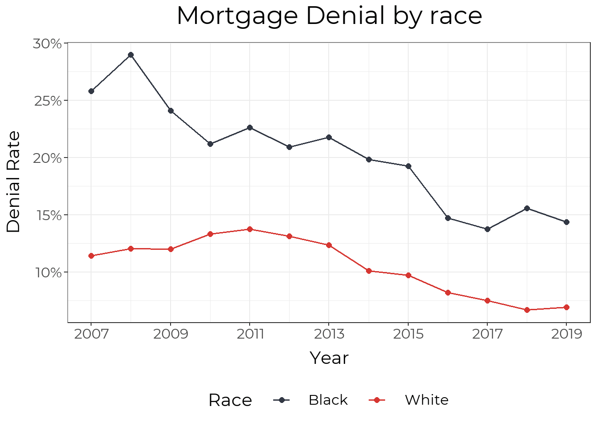

## Overview 

There is no one universally-accepted defintion of wealth within the Black community and, therefore, no direct data on Black Wealth in Louisville. Here we assess national data and local homeownership data to give the most complete information currently available. 

Wealth data remains scarce in general because the subject of wealth can be sensitive and is not taxed in a comprehensive way. Multiple surveys ask about income, and tax records show yearly income, but this data provides an incomplete picture, missing key metrics such as property ownership, community investment, inherited wealth, etc. As such, our measures of wealth remain indirect. 

The national Survey of Consumer Finances (SCF), which occurs every three years, is our best source of wealth data. It measures "all assets over which a family has legal claim that can be used to finance its present and future consumption". The most recently available data is from 2019, leaving the impact of the ongoing pandemic undefined. The key findings from the [Federal Reserve report](https://www.federalreserve.gov/econres/notes/feds-notes/disparities-in-wealth-by-race-and-ethnicity-in-the-2019-survey-of-consumer-finances-20200928.htm) include:

- The median white family has \$188,200, while the median Black family has \$24,100, <i>less than 15% of what white families hold.</i> 
- After falling from 2007 to 2013, median Black wealth has increased from 2013-2019; however, the gap between White and Black families remains largely unchanged. 
- The gap in wealth starts at an early age, with white families under 35 having a median wealth of \$25,400 and Black families having \$600. 
- Inheritances and other sources of family support are the single largest driver of the racial wealth gap. 
- White families are more likely to own homes at any age, but the Black-White gap is largest in households under 35, likely reflecting parental wealth. 

## Housing 

While housing is not the sole source of wealth, it represents a significant component. Housing reflects both historical wealth patterns––parental wealth makes it easier to buy a home––and is a major generator of wealth as, historically, homes have risen in value, increasing the wealth of those who own them. 

The data show stark divides between Black and white families throughout the homeownership process, demonstrating one aspect of the wealth gap. 

### Initial Wealth

We start with the overall wealth data showing less parental wealth and therefore less help with purchasing an initial home. 
(I think more context/stats, etc is needed here)

### Securing a Mortgage 

While the wealth gap has a number of causes, a major cause related to housing is [redlining](https://www.arcgis.com/apps/MapSeries/index.html?appid=a73ce5ba85ce4c3f80d365ab1ff89010) - explicitly denying loans to Black families who wanted to purchase houses in certain neighborhoods. In 2019, Black residents were denied loans at nearly twice the rate of white residents.

If and when a loan application is accepted, interest rates are higher and the total mortgage amount allocated to Black residents is lower than 

Overall, Black residents in Louisville receive fewer than half the number of mortgages per capita as White residents. 

[Nationally](https://www.federalreserve.gov/econres/notes/feds-notes/disparities-in-wealth-by-race-and-ethnicity-in-the-2019-survey-of-consumer-finances-20200928.htm), 46% of white families and only 17% of Black families in households under 35 own homes. While this gap closes slightly as households age (list example comparison in older age group), early ownership allows for more time to build wealth. 

### Home Valuation over Time 

The racial wealth gap in housing extends beyond home buying. Considering home appreciation values by geography, there is a clear pattern: houses in Black neighborhoods appreciate at a slower rate, building less wealth. 

### Home Valuation by Geography

On average, owner-occupied homes in Black neighborhoods are undervalued by $48,000 per house in the U.S. [According to that same reserach by the Brookings Institute](https://www.brookings.edu/research/devaluation-of-assets-in-black-neighborhoods/) The median home value in majority Black neighborhoods is \$89,681, but would be \$117,593 if houses were not devalued in the Louisville Metro Area. This difference consistutes a 27% undervaluation from what home values in Black neighborhoods would be if based on structural characteristics (e.g. sq. ft, year built) and neighborhood amenities (e.g. walkability, school districts, commute time).

### Property Taxes

While facing lower home values on the market, Black homes are overvalued by the property tax administration, and thus face [higher taxation relative to the market value of their homes](https://www.washingtonpost.com/context/the-assessment-gap-racial-inequalities-in-property-taxation/215957a4-d5ad-47cd-821a-070cf23b6bc7/). 

## The Tip of the Iceberg 

We have the most data on housing, but this is not the only area of wealth building where systemic inequality is pervasive. Black families start with less wealth (and therefore have less opportunities to build on it even in an 'equal’ market) and face discrimination at each step of the process. A better understanding of what metrics are important for describing Black wealth in both quantitative and qualitative terms is important to improve our work in this area. 

